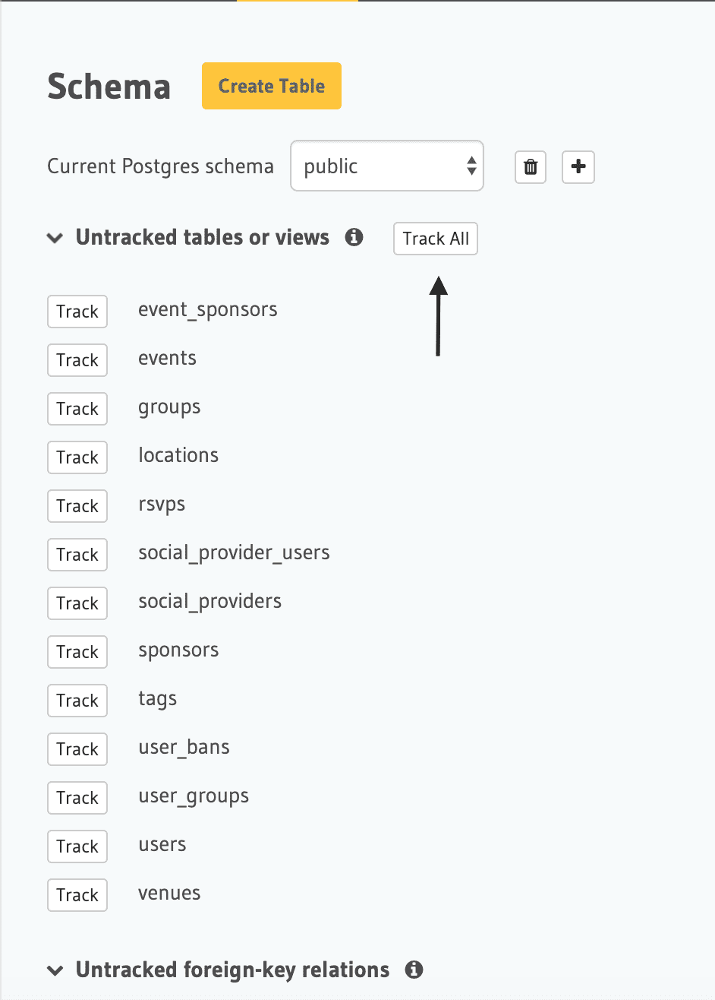
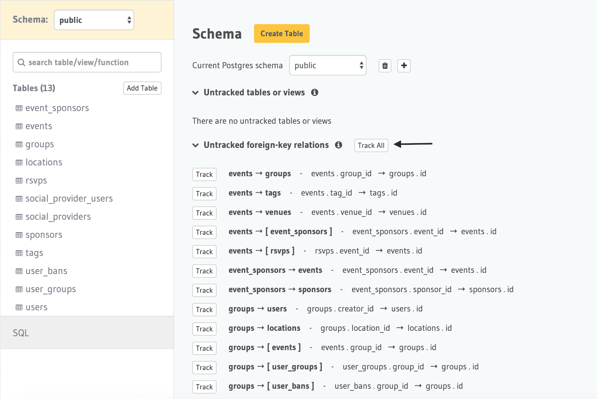

# GraphQL API Local Setup

**Step 1:**
Start Postgres and Hasura

```bash
docker-compose up -d
```

**Step 2:**
Apply the schema

```bash
psql -h <your_host> -p 5432 -U postgres -d postgres -f <path_to_sql>
```

For example:

```bash
psql -h 192.168.1.10 -p 5432 -U postgres -d postgres -f ./data/ddl.sql
```

**Step 3:**

Open Hasura Console running at `http://localhost:8080` and track these tables on `Data` tab. The URL for data tab would be `http://localhost:8080/console/data/schema/public`



**Step 4:**

Track relationships



**Step 5:**

Explore the GraphQL APIs via GraphiQL

The GraphQL API Endpoint is `http://localhost:8080/v1/graphql`


